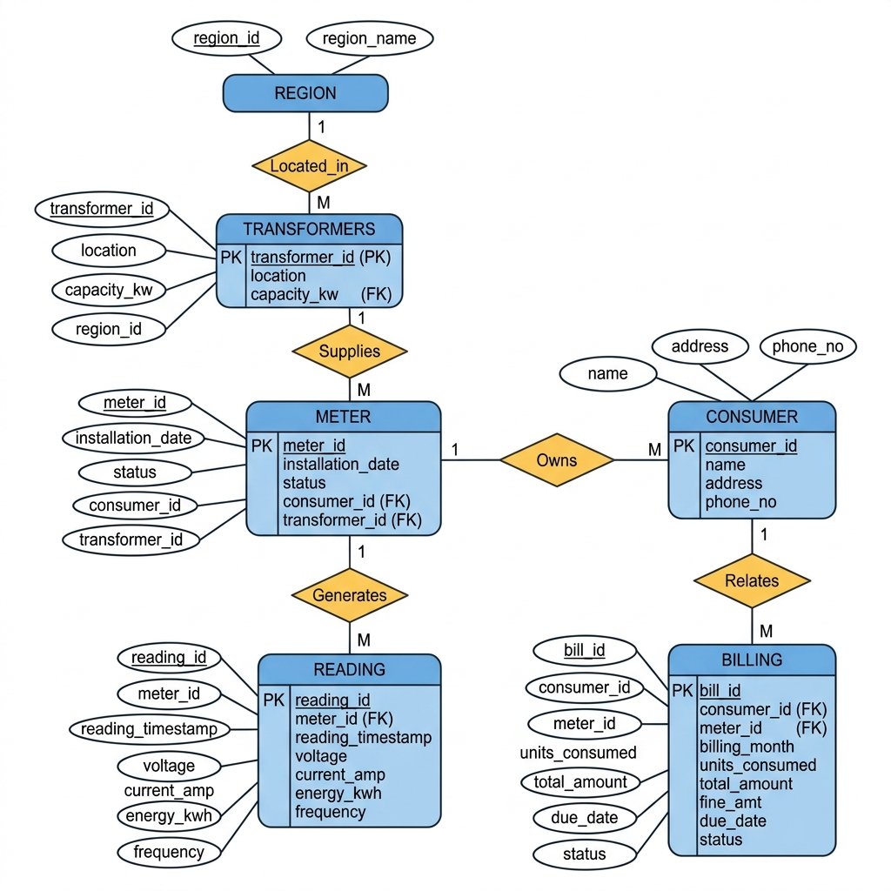

# ⚡ Smart Energy Metering System — DBMS Mini Project

## 📊 ER Diagram

---

## 🔗 Relationships

| # | Parent Entity | Child Entity | Relationship | Cardinality |
|---|--------------|--------------|--------------|-------------|
| 1 | Region | Transformers | Located_in | 1 : M |
| 2 | Transformers | Meter | Supplies | 1 : M |
| 3 | Consumer | Meter | Owns | 1 : M |
| 4 | Meter | Reading | Generates | 1 : M |
| 5 | Consumer | Billing | Relates | 1 : M |

---

## 🔑 Foreign Keys

| Child Table | Foreign Key Column | References |
|---|---|---|
| transformers | `region_id` | region(`region_id`) |
| meter | `consumer_id` | consumer(`consumer_id`) |
| meter | `transformer_id` | transformers(`transformer_id`) |
| reading | `meter_id` | meter(`meter_id`) |
| billing | `consumer_id` | consumer(`consumer_id`) |
| billing | `meter_id` | meter(`meter_id`) |

---

## 🗂️ Tables

| # | Table | Columns | PK | FKs | Description |
|---|-------|---------|-----|-----|-------------|
| 1 | region | 2 | region_id | — | Geographical regions |
| 2 | transformers | 4 | transformer_id | 1 | Electrical transformers per region |
| 3 | consumer | 4 | consumer_id | — | Electricity consumers |
| 4 | meter | 5 | meter_id | 2 | Smart meters at consumer premises |
| 5 | reading | 7 | reading_id | 1 | Energy readings (voltage, current, kWh, frequency) |
| 6 | billing | 9 | bill_id | 2 | Monthly bills with fine tracking |
